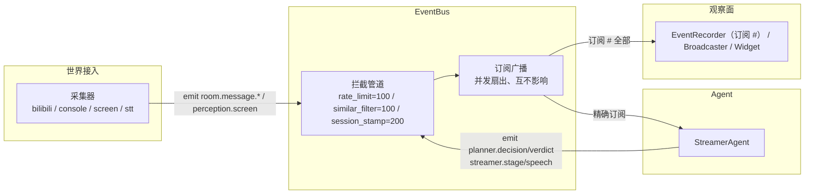

# 事件系统

Amaidesu 采用**发布-订阅（Pub/Sub）模式**构建事件驱动架构，EventBus 是组件间松耦合通信的唯一通道，内部分为两条职责清晰的通道：**拦截管道**（有序、可改可拦）与**订阅广播**（并发、互不影响）。

> **架构版本**：本文档对应 v2 **语义域事件**（无三阶段 Input/Decision/Output 概念）。命名规范详见 [事件命名规范](event-naming-convention.md)。

## 目录

- [架构概述](#架构概述)
- [核心组件](#核心组件)
- [核心 API](#核心-api)
- [通配订阅（AMQP topic 风格）](#通配订阅amqp-topic-风格)
- [事件事实表与拓扑](#事件事实表与拓扑)
- [WS 类型规则](#ws-类型规则)
- [事件载荷类型](#事件载荷类型)
- [事件注册机制](#事件注册机制)
- [事件拦截器（Interceptor）](#事件拦截器interceptor)
- [边界规则](#边界规则)
- [时间字段约定](#时间字段约定)
- [使用示例](#使用示例)

---

## 架构概述

一条事件从发布到消费经过两段彼此独立的机制：

1. **拦截管道**（有序）：emit 后、分发前，事件依次过拦截器链（按显式 `priority` 升序）。拦截器可净化/修改 payload，返回 `None` 即丢弃事件——一次拦截，所有订阅者共享净化后的结果。
2. **订阅广播**（并发）：匹配到的所有订阅者以独立任务并发执行，完成顺序不定；一个订阅者抛异常被计数并写日志，不影响其他订阅者。订阅者之间**没有顺序语义**（有序处理只属于拦截管道）。



组件间数据流与边界硬约束（采集器不订阅下游结果、Agent 内部件不注册为工具等）见 [数据流与边界规则](data-flow.md)。

---

## 核心组件

| 组件 | 文件位置 | 职责 |
|------|----------|------|
| **EventBus** | `src/modules/events/event_bus.py` | 事件总线核心：emit / on / off、精确 + 通配匹配、拦截器链、统计 |
| **EventRegistry** | `src/modules/events/registry.py` | `@register_event` 装饰器 + `EVENT_REGISTRY` + 启动一致性硬检查 |
| **CoreEvents** | `src/modules/events/names.py` | 事件名常量（25 个具名 + 3 个通配占位符） |
| **Payloads** | `src/modules/events/payloads/*.py` | 事件载荷类型（Pydantic，按语义域分包） |
| **EventInterceptor** | `src/modules/events/interceptors/*.py` | 拦截管道（限流 / 相似过滤 / 场次盖章） |
| **EventHistoryRecorder** | `src/modules/events/event_recorder.py` | 事件记录器：订阅 `#`（全部事件）写内存环形缓冲 |
| **EventBroadcaster** | `src/modules/dashboard/websocket/broadcaster.py` | Dashboard WS 广播（订阅清单见事实表） |

### 模块结构

```
src/modules/events/
├── __init__.py           # 模块导出
├── event_bus.py          # EventBus 核心实现（emit / on / off / 通配匹配 / 拦截器链）
├── event_history.py      # EventHistoryService（纯内存环形缓冲，运行周期观察窗）
├── event_recorder.py     # EventHistoryRecorder（订阅 # 全部事件 → 记录）
├── event_type_map.py     # WS 类型名（room.message 折叠例外，唯一非直通映射）
├── names.py              # CoreEvents 常量（25 具名 + 3 通配占位符）
├── registry.py           # @register_event + EVENT_REGISTRY + ensure_registry_consistency
├── interceptors/
│   ├── base.py           # EventInterceptor 基类（scope_prefixes / priority / intercept）
│   ├── chain.py          # InterceptorChain（按 priority 升序执行）
│   ├── lookup.py         # 拦截器共用 payload 字段查找（嵌套 user.id 优先）
│   ├── rate_limit.py     # 限流（priority=100）
│   ├── similar_filter.py # 相似文本过滤（priority=100）
│   └── session_stamp.py  # 场次盖章（priority=200）
└── payloads/
    ├── __init__.py       # Payload 统一导出
    ├── base.py           # BasePayload / OpenPayload（开放载荷，extra=allow）
    ├── core.py           # core.* Payload
    ├── live.py           # live.* Payload（LiveStartedPayload / LiveEndedPayload 两类）
    ├── room.py           # room.message.* Payload（一类六注册）
    ├── game.py           # game.* Payload（一类四注册）
    ├── perception.py     # perception.screen Payload
    ├── rundown.py        # rundown.changed Payload
    ├── tasks.py          # task.changed Payload
    ├── planner.py        # planner.decision / planner.verdict / streamer.stage Payload
    ├── speech.py         # streamer.speech Payload
    ├── tool_result.py    # tool.result.* Payload（不绑定具体名）
    ├── tool_health.py    # tool.health.* Payload（不绑定具体名）
    └── utterance.py      # tts.utterance.* Payload
```

---

## 核心 API

### 发布事件（emit）

```python
await event_bus.emit(
    event_name: str,          # 事件名称（语义域命名）
    data: BaseModel,          # Pydantic Model 实例（自动 model_dump）
    source: str = "unknown",  # 事件源（通常是发布者类名）
)
```

- emit **立即返回**：订阅者在后台任务中并发执行，发布方不等待完成
- **只接受 Pydantic Model**：其他类型直接 `TypeError`
- **判别一致性校验**：payload 类声明 `_DISCRIMINANT_FIELD` 时（`RoomMessagePayload.message_type` / `GamePayload.event_type`），事件名末段必须等于判别字段值，不符即 `ValueError`——同族多注册的 payload 挂错事件名在发布期暴露

### 订阅事件（on）

```python
event_bus.on(
    event_name: str,   # 精确名 或 通配 pattern（如 "tool.result.#"）
    handler: Callable, # **必须是 async def**（同步函数注册时直接 TypeError）
    model_class: Type, # Payload 类型（必填；通用消费者用 OpenPayload 保留全部字段）
)
```

订阅者契约：并发执行、互不影响。一个订阅者抛异常时，其他订阅者照常执行，异常被计入 `EventStats.error_count` 并写 ERROR 日志。**没有 priority、没有顺序**——有序处理属于拦截器。

### 取消订阅（off）

```python
event_bus.off(event_name: str, handler: Callable)
```

通配 pattern 订阅可直接 `off("tool.result.#", handler)` 移除（pattern 是 `_handlers` 的字典键）。

### 生命周期与统计

```python
await event_bus.cleanup(timeout: float = 5.0, force: bool = False)
stats = event_bus.get_stats(event_name)      # emit_count / listener_count / error_count /
                                             # last_emit_time / last_error_time / total_execution_time_ms
event_bus.reset_stats(event_name=None)
```

> 统计键是**真实 emit 的 event_name**（与通配 pattern 解耦）：`tool.result.#` 通配订阅不影响 `tool.result.speak` 的独立统计。

---

## 通配订阅（AMQP topic 风格）

通配匹配采用 **AMQP topic 风格**：`*` 匹配恰好一个词段，`#` 只能放在末尾并匹配零或多个剩余词段。仅订阅名含 `*` / `#` 时启用通配路径，纯字面量名走精确匹配（无额外开销）。

### 语义

| 通配符 | 行为 | 示例 |
|--------|------|------|
| `*` | 消耗**恰好 1 个** dot-separated token（单层） | `room.*` 匹配 `room.message`，**不**匹配 `room.message.danmaku` |
| `#` | **仅在 pattern 末尾**有效，消耗 **≥0 个**剩余 token（多层，可匹配空） | `tool.result.#` 匹配 `tool.result`、`tool.result.speak`、`tool.result.a.b.c` |
| `#`（独立） | 无前缀，匹配一切 | `#` 匹配 `anything.you.want`（事件记录器用它订阅全部事件） |

### 匹配示例

| Pattern | 匹配 | 不匹配 |
|---------|------|--------|
| `room.*` | `room.message` | `room.message.danmaku`（`*` 只消耗 1 个 token） |
| `tool.result.#` | `tool.result`、`tool.result.speak`、`tool.result.a.b.c` | `tool.x.speak`（前缀不匹配） |
| `room.message.#` | `room.message.danmaku` 等所有子类 | `room.control`（前缀不匹配） |
| `room.message.danmaku`（精确） | `room.message.danmaku` | `room.message.gift`（字面量逐字符相等） |

**匹配到的所有订阅者并发执行，无排序**：精确与通配、通配与通配同时命中时没有先后语义。

---

## 事件事实表与拓扑

> **单一事实源**：本表是 Amaidesu 当前全部 **25 个具名事件 + 3 个通配占位符**的权威定义（与 `CoreEvents` 一致，启动硬检查 `ensure_registry_consistency()` 守护）。任何新增/删除/重命名事件，**必须先修改本表再写代码**。"发布者 / 订阅者"两列即事件拓扑事实；订阅者均含事件记录器（catch-all），表中不再重复标注。

| 事件名 | Payload 类 | 发布者 | 订阅者（记录器除外） | 说明 |
|--------|-----------|--------|--------|------|
| `core.startup` | `CoreStartupPayload` | `main.py` 启动流程 | `Broadcaster`（直通） | 系统启动通知 |
| `core.shutdown` | `CoreShutdownPayload` | `main.py` 关闭流程 | `Broadcaster`（直通） | 系统关闭通知 |
| `core.error` | `CoreErrorPayload` | 各组件错误兜底发射 | `Broadcaster`（直通）；Dashboard 首页"最近异常"按 `core.error` 判定 | 系统级错误；level 推导为 error |
| `live.started` | `LiveStartedPayload` | `LiveSessionManager`（`open_session`：手动开启 / 回放自动开启） | `StreamerAgent`（放行主动发言）；`Broadcaster`（直通） | 显式场次开启；payload 含 `live_session_id`（INTEGER 主键）/ `source`（manual/replay）/ `title` / `room_id` / `started_at_ms` |
| `live.ended` | `LiveEndedPayload` | `LiveSessionManager`（`close_session` / 进程退出收口 / 回放结束） | `StreamerAgent`（收闸主动发言）；`Broadcaster`（直通） | 显式场次结束；payload 含 `reason` / `duration_ms` / `empty_discarded` / `ended_at_ms` |
| `room.message.danmaku` | `RoomMessagePayload` | bilibili 采集器（official / legacy）；console 输入；`collectors/base.py` 兜底转发；Dashboard debug 注入；模拟器（generate / replay） | `StreamerAgent`（进弹幕缓冲驱动决策）；`StorageLedger`（订 `room.message.#` 落 live_chat + viewers 统计）；`Broadcaster`（WS type `room.message`）；`DanmakuWidgetService` | 弹幕；`message_type="danmaku"`，填 `content` |
| `room.message.gift` | `RoomMessagePayload` | bilibili 采集器（official / legacy）；console 输入；兜底转发 | `StreamerAgent`（TimingGate 判定付费消息强制进决策轮）；`StorageLedger`（通配 → gifts 落库 + 礼物计数）；`Broadcaster`；`DanmakuWidgetService` | 礼物；`message_type="gift"`，填 `gift` 结构体 |
| `room.message.super_chat` | `RoomMessagePayload` | bilibili 采集器（official / legacy）；console 输入；兜底转发 | `StreamerAgent`（付费消息强制进决策轮）；`StorageLedger`（通配 → super_chats 落库）；`Broadcaster`；`DanmakuWidgetService` | SuperChat；`message_type="super_chat"`，填 `content` + `sc` |
| `room.message.guard` | `RoomMessagePayload` | bilibili official 采集器（GuardMessage 分支）；console `/guard` 命令 | `StreamerAgent`（付费消息强制进决策轮）；`StorageLedger`（通配 → live_chat，`sender_role="guard"`） | 上舰（舰长/提督/总督，付费消息）；`content` 填人读描述，供下游优先回应 |
| `room.message.enter` | `RoomMessagePayload` | bilibili 采集器；console 输入；兜底转发 | `DanmakuWidgetService`；`StorageLedger`（enter 行 debug 丢弃，不落库） | 进房；`message_type="enter"`。决策侧不消费 |
| `room.message.partner_speech` | `RoomMessagePayload` | STT 采集器（联动对象发言） | `StorageLedger`（通配 → live_chat，`sender_role="partner"`，不计观众统计） | 房间里第三个说话者（非弹幕、非主播） |
| `perception.screen` | `ScreenDescriptionPayload` | 屏幕变化采集器（screen） | `StreamerAgent`（画面描述进 RoomState，经环境参考进决策上下文） | 主播视觉感知；不落 live_chat（避免"屏幕内容当弹幕"污染） |
| `game.milestone` | `GamePayload` | 游戏 Agent（BaseAgent 事件上报面） | `StreamerAgent`（叙事收集进 Planner 上下文）；`StorageLedger`（订 `game.*` → `game_events` 表） | 游戏重大进展（挖到钻石 / 通关章节）；`event_type="milestone"` |
| `game.attention_required` | `GamePayload` | 游戏 Agent | 同上 | 安全阀偏差报告（"我先回血再去挖钻石"）；`event_type="attention_required"` |
| `game.error` | `GamePayload` | 游戏 Agent | 同上 | 游戏异常（主播由此得知命令失败等原因）；`event_type="error"` |
| `game.report` | `GamePayload` | 游戏 Agent（`minecraft_report` 工具回调 / 批次终止兜底交付） | 同上；主播"是否回提示词"的决策数据源 | 游戏 Agent 主动上报：`report_kind`（`delivery` / `escalation`，仅本事件有值） |
| `rundown.changed` | `RundownChangedPayload` | `RundownState`（唯一变更边界：工具 / Dashboard 手动 / 闹钟兜底三路同径） | `Broadcaster`（直通） | 流程单变更：load / goto / next（含 finish）/ pause / resume；`by` 区分 agent/human/system；finish 时 `segment_id=""` 且 `index==total` |
| `task.changed` | `TaskChangedPayload` | 任务记录表（`TaskLedger` / `TaskTracker`，仅状态真迁移或停滞告警时发） | `BaseAgent`（全部 Agent 基类订阅，按 `payload.initiator == self.name` 过滤唤醒） | 异步任务生命周期（受理 → 进行中 → 终态）；通知是提示、记录表是事实源 |
| `planner.decision` | `PlannerDecisionPayload` | `StreamerAgent`（两阶段决策收口，每轮恰好一条） | `Broadcaster`（直通，决策卡数据源） | 决策轮记录：`round_id`（本轮全链路关联键）、决策结论、`reply_to_message_id`、`silent_reason`、`llm_request_id`、分段耗时 |
| `planner.verdict` | `PlannerVerdictPayload` | `ReplyToolProvider`（reply 工具被调用、表达生成之前） | `Broadcaster`（直通，裁决卡实时渲染） | 裁决时刻即时事件：`round_id` / `topic_summary` / `reply_guidance` / `confidence` / `target`。沉默轮无 verdict |
| `streamer.stage` | `StreamerStagePayload` | `StreamerAgent`（决策循环边界） | `Broadcaster`（直通，状态条数据源） | 决策管线阶段（planning / replying / idle）；LLM 挂起时状态条停格即证据 |
| `streamer.speech` | `StreamerSpeechPayload` | `StreamerAgent`（speech 非空时统一发射出口） | `SimulatorService`（节奏唤醒）；`StorageLedger`（落 live_chat `sender_role="assistant"` 行）；`Broadcaster`（直通） | 主播发言业务事实（与 TTS 启用正交）；`utterance_id` 与 `tts.utterance.*` 共用关联键；`reply_to_message_id` 与 live_chat 观众行构成互动关联 |
| `tts.utterance.started` | `UtteranceStartedPayload` | TTS 引擎（流式=首块 PCM 写声卡；全量=`play_audio` 调用；仅 `handle_speech` 收到非空 `utterance_id` 时发） | 无业务订阅者（字幕接线属预留） | 一次发声开始；`utterance_id`（`utt_{epoch_ms}_{seq}`）/ `speech_text` / `engine` / `duration_ms`（流式合成未完=None） |
| `tts.utterance.finished` | `UtteranceFinishedPayload` | TTS 引擎（播放完成时刻） | 无业务订阅者（句末再决策等消费者预留） | 一次发声播放完成；`duration_ms` 由 PCM 样本数÷采样率计算（百毫秒级精度，不含声卡缓冲残余） |
| `tts.utterance.failed` | `UtteranceFailedPayload` | TTS 引擎（合成 / 播放失败时） | 无业务订阅者（错误兜底消费者预留） | 一次发声失败；payload 含 `error_message` |
| `tool.result.<tool_name>` | `ToolResultPayload` | `ToolRegistry.invoke`（工具执行完成即广播，无论成败） | `Broadcaster`（订 `tool.result.#` 通配） | 工具结果回传；事件名 emit 时动态填（`ToolSpec.result_event` 可定制）；payload 含 `tool_name` / `status` / `arguments` / `result` / `error_message` / `round_id` |
| `tool.health.<tool_name>` | `ToolHealthPayload` | `ToolRegistry`（熔断 → `state="open"`；探活恢复 → `state="closed"`；仅状态切换时发） | `Broadcaster`（订 `tool.health.#` 通配） | 工具健康切换；payload 含 `tool_name` / `provider` / `state` / `failure_count` / `last_error` |
| `tool.result.#`（**通配占位符**，不注册到 `EVENT_REGISTRY`） | 无（仅订阅标识） | — | — | `CoreEvents.TOOL_RESULT_WILDCARD` 保留作订阅标识；具体名动态族，见 [事件注册机制](#事件注册机制) |
| `tool.health.#`（**通配占位符**，不注册到 `EVENT_REGISTRY`） | 无（仅订阅标识） | — | — | `CoreEvents.TOOL_HEALTH_WILDCARD` 保留作订阅标识 |
| `room.message.#`（**通配占位符**，不注册到 `EVENT_REGISTRY`） | 无（仅订阅标识） | — | — | `CoreEvents.ROOM_MESSAGE_WILDCARD` 保留作订阅标识；`StorageLedger` 用它一站式落库 |

### WS 类型规则

Dashboard WebSocket 的 `type` 字段 = **事件名直通**；唯一例外是 `room.message.*` 折叠为 `"room.message"`（前端多处按此聚合过滤），该例外名是 `event_type_map.py` 的唯一内容。前端（如 Dashboard 首页异常判定）消费 `core.error` 等精确名。

---

## 事件载荷类型

所有载荷继承 `BasePayload`（Pydantic），统一携带 uuid4 的 `id` 字段——EventBus 经 `model_dump → model_validate` 分发，所有订阅者从同一 dict 读回该 id，是记录与广播等通道的幂等去重依据。子类可覆盖 `get_log_format()` 自定义日志格式。

| 形态 | 类 | 事件 |
|---|---|---|
| 一类多注册 + 判别字段 | `RoomMessagePayload`（`_DISCRIMINANT_FIELD="message_type"`） | `room.message.*` 六事件 |
| 一类多注册 + 判别字段 | `GamePayload`（`_DISCRIMINANT_FIELD="event_type"`） | `game.*` 四事件 |
| 一事件一个类 | `LiveStartedPayload` / `LiveEndedPayload`（字段本就不同） | `live.started` / `live.ended` |
| 一事件一个类 | `CoreStartupPayload` / `CoreShutdownPayload` / `CoreErrorPayload` / `ScreenDescriptionPayload` / `RundownChangedPayload` / `TaskChangedPayload` / `PlannerDecisionPayload` / `PlannerVerdictPayload` / `StreamerStagePayload` / `StreamerSpeechPayload` | 各自对应 |
| 一事件一个类（形状不同） | `UtteranceStartedPayload` / `UtteranceFinishedPayload` / `UtteranceFailedPayload` | `tts.utterance.*` 三事件 |
| 不绑定具体名（动态族） | `ToolResultPayload` / `ToolHealthPayload` | `tool.result.<name>` / `tool.health.<name>` |
| 开放载荷 | `OpenPayload`（`extra="allow"`，保留任意字段） | 无绑定事件；通用消费者（记录器）的 model_class |

> `tts.utterance.*` 三事件是终点广播：消费者不得基于这些事件触发新一轮决策（防环，见[边界规则](#边界规则)）。

---

## 事件注册机制

`@register_event` 装饰器把 Payload 类注册到模块级 `EVENT_REGISTRY` 字典：

```python
@register_event("room.message.danmaku")
@register_event("room.message.gift")   # 同类可堆叠注册多个事件名
class RoomMessagePayload(BasePayload): ...
```

- **反向引用**：被装饰类获得 `_registered_event_name`（多名时为 `_MultiName` 对象，`==` 与任意已注册名相等）与 `_all_registered_names`（`frozenset`）
- **冲突检查**：同一事件名被注册为**不同类型**时抛 `ValueError`

### 启动钩子与硬检查

```python
register_core_events()          # 触发全部 payload 模块 import（装饰器随之执行），
                                # 并登记动态事件族（tool.result. / tool.health. 前缀 → payload 类型）
ensure_registry_consistency()   # 启动硬检查：EVENT_REGISTRY 与 CoreEvents 具名事件
                                # 集合必须完全一致（动态族成员豁免），缺失/多余即 RuntimeError 拒启
```

`main.py` 启动序列在 `register_core_events()` 之后立即调用硬检查——事件契约漂移（漏注册 / 多注册）在启动期暴露，不进入运行时。

---

## 事件拦截器（Interceptor）

"在事件路上拦一下做点事"的全局单点：emit 后、订阅者收到前，**所有事件过同一道拦截器链**。拦截器看到的 payload 是 `model_dump()` 后的 dict（与下游 handler 形态一致）；返回 dict 放行（可原地修改），返回 `None` 丢弃事件；拦截器自身抛异常被捕获并视为 pass-through（异常不丢事件）。

### 内置拦截器

| 拦截器 | priority | 作用域 | 职责 |
|--------|----------|--------|------|
| `RateLimitInterceptor` | 100 | `room.message.*` | 全局 / 单用户滑动窗口限流（防刷屏）；用户标识经共用 `lookup.extract_user_id` 提取（嵌套 `user.id` 优先，顶层键兜底） |
| `SimilarFilterInterceptor` | 100 | `room.message.*` | 相似文本合并（滑动窗口内相似度超阈值丢弃） |
| `SessionStampInterceptor` | 200 | room.message. / streamer. / planner.decision / tool.result. / game. | 场次盖章：`live_session_id=0` 的业务事件统一注入当前场次主键（单点注入、全链一致；归属解析失败放行原 payload 不阻断） |

**执行顺序 = `priority` 升序**（数值小者先行，同值按注册顺序），与 `add_interceptor` 的注册顺序解耦：净化类（限流 / 相似过滤）先于加工类（场次盖章），被净化丢弃的消息不消耗归属解析。

### 核心 API

```python
class MyInterceptor(EventInterceptor):
    priority = 150                     # 显式优先级（可选，默认 100）
    scope_prefixes = ("room.message.",)  # 作用域（空元组 = 不限域）

    @property
    def name(self) -> str:
        return "my_filter"

    async def intercept(self, event_name, payload, source):
        if is_noise(payload):
            return None          # None = 丢弃事件
        return payload           # dict = 放行（可原地修改）

event_bus.add_interceptor(MyInterceptor())   # 挂载
event_bus.remove_interceptor("my_filter")    # 按 name 卸载
event_bus.get_interceptor_names()            # 已挂载拦截器（按执行顺序）
```

注册入口在 `main.py` 的 `register_event_interceptors()`，配置来自 `infra.toml` 的 `[interceptors.<name>]`。

> 敏感词净化不在拦截器层，主播发言统一出口在 Replyer 的 ProfanityFilter。

---

## 边界规则

事件系统作为公共通道，以下边界由[架构红线](../AGENTS.md)派生，违反即架构回退：

**谁可以发布**

- 采集器只发布数据事件（`room.message.*` / `perception.screen`）；下游结果的查询诉求走工具实现——"能挥手吗"可问，"刚才挥手成功了吗"不可问
- 工具是被动调用方：执行完成后由 `ToolRegistry` 统一发布 `tool.result.<name>`，工具本体不发布其他事件
- TTS 引擎是基础模块：只发 `tts.utterance.*`、不订阅任何事件（发布-only）
- 快照型能力（被调才看）实现为工具，持续流型实现为采集器

**谁可以订阅**

- Agent 订阅语义域事件驱动决策（如 `StreamerAgent` 订阅 `room.message.danmaku`）；Agent 内部的 Planner / Replyer 本体代码直连，不经事件订阅
- 观察面组件（记录器 / Broadcaster / Widget）订阅只读，不得反向触发表演类副作用

**防环约束**

- `tts.utterance.*` 是**终点广播**：消费者不得基于这些事件触发新一轮决策（否则形成 "TTS→决策→TTS" 无限循环）
- `streamer.speech` 是业务信号：订阅者（节奏唤醒 / 落库 / 字幕）不得反向触发表演类副作用
- 工具不订阅 Input 事件（仅 fire-and-forget 后回传 `tool.result.*`）

**通道选择**

- 需要跨组件广播"已发生的事实"→ 事件（本通道）
- 需要调用并拿返回值 → 直接函数调用或工具调用，不发事件（禁止 RPC 式 `request` / 同步 `emit_sync` 复活）

---

## 时间字段约定

项目统一使用**毫秒（ms）**作为时间单位。时刻字段用 `int` Unix epoch 毫秒，时长/超时字段用毫秒，命名统一 `<name>_ms`（如 `timestamp_ms` / `started_at_ms` / `duration_ms`）。

```python
from src.modules.time_utils import now_ms, elapsed_ms, format_duration_ms, ms_to_datetime

ts = now_ms()                        # 当前时刻（int 毫秒）
elapsed = elapsed_ms(start_ms=ts)    # 经过时长
format_duration_ms(1234)             # "1.2s"
```

**注意事项**：

- 禁止使用秒为单位的字段（如 `timestamp_s` / `duration_seconds`），如需人类阅读用 `ms_to_datetime()` 转换
- 历史代码中的 `timestamp` 字段通过 Pydantic `alias` 兼容（`alias="timestamp"`，实际字段为 `timestamp_ms`）

---

## 使用示例

### 基本发布-订阅

```python
from src.modules.events.event_bus import EventBus
from src.modules.events.names import CoreEvents
from src.modules.events.payloads import RoomMessagePayload, RoomMessageUser

event_bus = EventBus(enable_stats=True)

# 订阅（类型化；handler 必须 async）
async def handle_danmaku(event_name: str, data: RoomMessagePayload, source: str):
    print(f"收到弹幕: {data.content} (用户: {data.user.name})")

event_bus.on(CoreEvents.ROOM_MESSAGE_DANMAKU, handle_danmaku, model_class=RoomMessagePayload)

# 发布（立即返回；订阅者后台并发执行）
await event_bus.emit(
    CoreEvents.ROOM_MESSAGE_DANMAKU,
    RoomMessagePayload(
        message_type="danmaku",
        user=RoomMessageUser(id="12345", name="观众A"),
        content="主播好可爱！",
        timestamp_ms=now_ms(),
    ),
    source="BiliDanmakuOfficialCollector",
)

# 统计（按真实 emit 名入键）
stats = event_bus.get_stats(CoreEvents.ROOM_MESSAGE_DANMAKU)

await event_bus.cleanup()
```

### 通配订阅工具结果

```python
async def handle_any_tool_result(event_name: str, data: ToolResultPayload, source: str):
    # event_name 形如 "tool.result.speak"；handler 内按 payload 字段分发
    if data.tool_name == "speak":
        await on_speak_completed(data)

# 一站式监听所有工具结果（AMQP topic 风格通配）
event_bus.on(CoreEvents.TOOL_RESULT_WILDCARD, handle_any_tool_result, model_class=ToolResultPayload)

# emit 时使用具体名
await event_bus.emit(
    "tool.result.speak",
    ToolResultPayload(tool_name="speak", status="success", result={...}),
    source="speak_tool",
)
```

### 通配订阅错误处理

订阅者抛异常不影响其他订阅者；异常被计数（`get_stats(event_name).error_count`）并写 ERROR 日志——出错可见、不传播、不中断广播。

---

## 相关文档

- [架构总览](overview.md)
- [数据流规则](data-flow.md)
- [事件命名规范](event-naming-convention.md)
- [三范式开发指南](../development/component-guide.md)
- [架构决策记录](adr/README.md)
