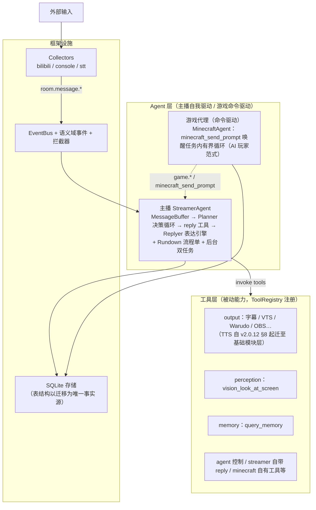

# Amaidesu 2.0.0 架构：从三阶段流水线到自主主播

> **本文定位**：这是 v2.0.0 重构的**完整叙事文档**——为什么推翻三阶段架构、"Agent + 工具"如何从第一性原理推导出来、各层怎样设计与落地。它回答"为什么是这样"；速查类内容（组件清单、事件全表、API 细节）见文末相关文档。

---

## 一、历史：四代架构与三次换皮

Amaidesu 的业务层组织方式经历过四代。git 历史考实了这条演化链：

| 代际 | 组织方式 | 内核 |
|------|----------|------|
| 第一代 | **插件系统**（≥24 个 BasePlugin，自包含平铺） | 按功能分类 |
| 第二代 | **3 域**（Provider 分类） | 按功能分类 |
| 第三代 | **3 阶段**（`src/stages/`：Input / Decision / Output） | 按数据流位置分类 |
| 第四代 | **2.0**（Agent + 工具，本文主角） | 按"谁驱动谁"分类 |

前三代有一个共同的隐疾：**每次重构只是换了业务层的分类外壳，内核没变**——Provider 改名 Collector/Decider/Handler 就成了三阶段；插件的"自包含平铺"与三阶段的"按位置切分"在依赖结构上同构。modules/ 共享设施从 3 域时代就存在，三代重构动的只是业务代码住哪个目录。

2.0 重构的第一课就来自这段历史：**如果只给旧模型换个名字，无论叫什么，都会长回原来的样子。**

## 二、三阶段架构为什么走不下去

三阶段流水线（采集器标准化消息 → Decider 决策出 Intent → Handler 并行渲染）作为过渡方案完成了使命，但长期演进暴露出四个结构性问题：

1. **Intent 是虚构的中间表示**。决策的本质是"调用渲染能力"，Intent 数据类和 `decision.intent.generated` 事件链是为管道而管道——真正需要 Intent 形状的消费者只有输出调度点自己。
2. **三套参与者生命周期并存**。Collector 用 `start()/collect()`、Decider 用 `setup()/decide()`、Handler 用 `init()/handle(intent)`，三种范式三套心智负担。
3. **加内容必须动框架**。新增直播玩法或游戏代理要改阶段管理器、注册表、事件链——框架没有做到"加内容零改动"。
4. **主播的主体性被肢解**。"聚合弹幕 → 判断要不要说话 → 生成表达 → 驱动渲染"这个完整的自主循环被拆散在三个阶段的 Manager 里，没有任何一处代码拥有闭环。主播退化成一台**被观众消息喂食的应答机**。

同期，以 MaiBot 为决策核心的桥接路线（maibot_decider 等）确认放弃：两个项目的架构已显著分化，桥接维护成本高于收益，Amaidesu 需要一条独立演进的主干。

## 三、第一性原理：从应答机到表达者

### 3.1 设计讨论走过的弯路（如实记录）

新架构不是一步到位想出来的。定案前的讨论经历了七轮迭代，其中前五轮全部失败：

| 轮次 | 方案 | 结局 |
|------|------|------|
| v1.0 初稿 | 六组件 Agent/EventSource/StateSensor/StateStore/ToolRuntime/Performer + Episode 命名 | ❌ 否——比喻式命名（"认知触角""表演终端"）不知所云 |
| v1.1 修正 | 承认 v1.0 本质 = 换皮三阶段 + 存储大杂烩 | ❌ 否——换皮不被接受 |
| v1.2–v1.3 | 引入"内容层/内容包"（@content 声明式组合基础设施） | ⚠️ 中间态——概念越叠越多 |
| v1.4 | 内容包被看穿为**插件换皮**，废除内容层 | 修正 |
| **v-final** | **Agent + 工具 + 存储 + 编排**，是什么就叫什么 | ✅ 定案 |
| **v-subjectivity** | 补上灵魂：主体性判据 | ✅ 定案 |

这段弯路本身给出了方法论结论：**判断一个新架构是否真"新"，不看命名和分层图，看它的驱动力模型变没变。**

### 3.2 主体性判据：空房间冷启动

> **核心目标：Amaidesu 2.0.0 是从"应答机"走向"表达者"。**

判别标准是一个硬性思想实验——**空房间冷启动**：

> 给系统一个直播空房间，没有任何观众、任何外界消息。问：系统会自己动吗？
>
> - 三阶段老架构：**静止**。管道由数据驱动，无外界刺激即停摆——它是应答机。
> - 有主体性的架构：**自主推进**。按节目单推进内容、主动开口、有自己的节奏——观众是锦上添花，不是燃料。

由此派生三个层级（缺一即滑向换皮）：**意图来自自我**（节目单/人格/目标，而非观众消息）、**行为自主**（主动说话/推进/取舍，而非被迫反应）、**独立核心**（不是任何外部 Bot 的外壳）。

### 3.3 核心判别式：谁驱动谁

落到工程上，整个架构收敛为一个判别式。从四个维度展开才能区分干净：

| | 谁驱动 | 形态 | 暴露 | 例子 |
|---|---|---|---|---|
| **主播 Agent** | 自我驱动（唯一），直播期间持续运行 | 继承 `BaseAgent`，拥有决策循环 + 后台维护 | 整个生命周期 + `list_tools()` 聚合到 ToolRegistry | `StreamerAgent`（Planner 决策循环 + 后台 BackgroundMaintainer） |
| **游戏 Agent** | 命令驱动（类 Code Agent）：命令唤醒，任务内有界循环，完成即停、空闲零消耗 | 同上 | 同上 | `TextAdvGameAgent`、`MinecraftAgent`（minecraft_send_prompt 唤醒） |
| **工具** | 被调才干活（纯被动，调用即返回 `ToolExecutionResult`） | 继承 `ToolProvider`，`list_tools()` + `invoke(ToolInvocation)` | 仅经 `ToolRegistry.invoke(name, args)` 暴露给 LLM | `vision_look_at_screen`、`memory_query_memory`、`vts_set_expression`（TTS 自 v2.0.12 §8 修正起已是基础模块，不再是工具） |

**判别口诀**：能自我维持状态/轮询/心跳的就是 Agent，只在被调用时执行的就是 Tool。落到工程上只需回答一句——"这个功能有没有自己的状态/轮询/心跳？"有就做成 Agent，没就做成 Tool。

这条规则同时约束**反对偷换概念**：基础能力（屏幕感知、记忆查询）即便被多个 Agent 复用，也应做成 Tool（走 ToolRegistry + Protocol 注入），而不是塞进某个 Agent 内部。Agent 包的红线细则见 §4.2。

以及一句对内容生产者的解放：**直播内容是编排配置 + Planner 上下文/行为模式的变化，不是代码模块。** 加一档节目不需要写代码，加一类游戏才需要一个新 Agent 包。

## 四、防换皮的两道铁闸

### 4.1 为什么需要铁闸

三代换皮史证明：没有结构性约束，重构会在惯性下退回原形。git 历史调研同时挖出了当年插件系统被废的五大理由（过度插件化、服务注册复杂度、插件间依赖成石山、消息流不清晰、配置分散）——2.0 对每一条都有明确的规避设计：

| 插件的错 | 2.0 的规避 |
|---|---|
| 核心功能也做成插件，必需与可选混杂 | 工具/存储/记忆/事件/LLM 全部是框架基础设施（`src/modules/`）；只有"主体"住在 Agent 包里 |
| 服务注册机制，依赖运行时才暴露问题 | 无服务注册；构造器注入 + 事件/工具契约 |
| 24 个插件互相依赖成石山 | 游戏 Agent 之间零依赖，经事件（`game.*`）/状态（工具，如 text_adv_get_story）/指令（minecraft_send_prompt 类工具）三通道松耦合 |
| 消息流经中心中转，链路不清 | Agent → 工具/事件/存储直达，单向清晰 |
| 全局/插件级配置混乱 | 六文件按领域拆分 + Pydantic Schema 校验 |

### 4.2 Agent 包边界硬规则

- ✅ Agent 包**只内聚主体的自我**：决策循环、目标、该内容的专属玩法逻辑
- ✅ 基础设施全部外借：感知用公用 `vision_look_at_screen`、记忆用 storage/memory、表达走框架 reply 体系
- ❌ 红线（出现即等于插件换皮）：自备感知后端 / 自建缓存 / import 其他 Agent 的模块 / 包里塞配置读取逻辑 / 依赖服务注册

**判别口诀**：插件是功能封闭自包含包（什么都自带、互相依赖）；Agent 包是主体开放内聚包（只带自我，能力全借框架，Agent 间零依赖）。

### 4.3 实现层的两条硬考验

所有主体性设计最终落在两条可检验的约束上：

1. **Planner 循环必须由自我意图（Rundown 流程单）驱动**，而非由"消息到达"驱动；
2. **空房间里 Planner 必须能自主产生行动**（推进 Rundown、主动说话），而非空转等喂食。

> ⚠️ 若最终实现仍是"收到消息 → 调 LLM → 渲染"，只是包一层 `while` 循环改名 Agent——那就是真换皮。

## 五、v2.0.0 全景

**Amaidesu 2.0.0 = Agent（自主主体）+ 工具（能力契约）+ 存储（状态/记忆）+ 编排（Rundown 流程单；ADR-011 取代 Agenda）**

各层要点：

- **主播 Agent**：`src/agents/streamer/`——弹幕窗 MessageBuffer 聚合，Planner 以 ReAct 循环决策（工具列表 = 全局 ToolRegistry + reply 局部工具，`planner_llm` 默认 llm 高质量模型，`planner_max_steps=8` 防失控）：查信息（游戏状态/记忆）→ 调 `reply` 工具 → Replyer 表达引擎生成 speech/emotion/action（含敏感词净化）。**Planner 与 Replyer 都是内部件，两者都不注册为工具**（reply_tool 是 LLM 调用入口）。Rundown 流程单子系统以"备忘录 + 闹钟"给环节方向，推进权归 Agent 自身。
- **游戏代理**（`src/agents/<name>/`，如 minecraft / text_adv）：AI 玩家范式——感知（公用 `vision_look_at_screen` 快照）、推进（专属工具如 text_adv_choose_option）、循环内聚于一个自包含包。加游戏 = 加包 + 配置，框架零改动。
- **工具层**：全部工具统一 ToolSpec 契约，三个来源——内置（进程内渲染/感知）、内容引擎（玩家引擎控制面）、MCP（外部扩展）。同步调用结果直返，异步工具经 `tool.result.<name>` 事件回传。
- **存储层**：SQLite 存储（具体表与字段以 schema_migrations 为唯一事实源）+ schema_migrations 版本化迁移；模拟数据带 `simulated` 列，统计查询一律排除——模拟观众不是观众。

## 六、支撑系统的同步升级

### 6.1 事件系统：语义域 + 通配订阅 + 拦截器

事件名从流水线位置词（`input.message.received`）改为语义域（`room.message.danmaku`）——事件描述"世界上发生了什么"，而不是"它处在管道第几站"。EventBus 支持 MQTT 风格通配订阅（`*` 单层 / `#` 多层尾缀）与最长前缀优先分发。

输入净化职责由 EventBus 分发层的**事件拦截器**承担（限流、相似过滤）。这里有一段收官插曲：v2 迁移初期曾把旧"输入管道"改造成拦截器但保留了旧"输出管道"框架，形成"零消费者的孤儿模块 + 文档虚构叙事"；2026-08-25 收官战将旧管道系统整体移除、`[pipelines]` 配置正名 `[interceptors]`，教训沉淀为一句话——**新建替代物之后必须同步清除旧物，否则文档会替死人说话。**

### 6.2 配置：六文件 + 每文件版本 + 包内权威 + 单一管线

`agents / collectors / tools / model / storage / infra` 六文件按领域拆分（`config/` 目录）；每文件自带 `[meta].version` 结构版本，经升级钩子注册表按区间独立推进（缺失硬错）。组件配置权威在各组件包内的 `ConfigSchema`（中央树只留槽位与聚合段），加载走单一管线（read → 版本推进 → Pydantic 校验硬错 → 漂移写回（备份 + 自写压标）→ 合并视图）。启用开关收敛为两处：`[agents].enabled` 与 `collectors.toml` 顶层 `enabled`；全局工具停用名单为 `[tools].disabled_tools`（重启生效）。设计决策见 [ADR-014](../decisions/014-config-six-file-refactor.md)。

### 6.3 错误隔离：让边界守边界，不让一处失败扩散成全局停摆

v2 的错误处理不是"防御性编程的清单"，而是一条贯穿边界的契约——**任一边界都对自己的失败负责，上层永远拿到结构化结果而非异常。**

这条契约有四个具名落点：

- **`ToolRegistry.invoke` 永远不抛异常**。未知工具返回失败 `ToolExecutionResult`；调用方抛异常也返回失败结果 + `error_message`。Agent/LLM 在工具失败时仍能拿到结构化结果继续推进，而不是被异常打断决策循环。
- **事件拦截器**返回 `None` 即丢事件；拦截器内部异常被吞并放行——上游 bug 不能阻塞全链路分发。
- **Collector 后台消费任务**异常被 catch（`CancelledError` 重抛），单次循环出错不影响采集器后续轮次。
- **`AgentManager.stop_all` / `cleanup_all`** 按注册顺序逐一 try/except，单个 Agent 失败不影响其余 Agent；`Dashboard` 启动失败（ImportError 等）仅 warning，整体仍可继续运行。

工程含义是双重的：一方面单点故障被局部化——一个工具挂掉不会拖垮 Agent，一个 Agent 停不下来不会卡住其他 Agent 的清理；另一方面上层不需要到处包 try/except，假设下层永远返回结构化结果。这反过来要求每条边界都对自己的失败"兜底"——边界守边界。

### 6.4 依赖注入：服务走构造器，数据走参数

v2 的依赖传递有且只有两条路径：

- **服务对象**（`EventBus` / `LLMManager` / `PromptManager` / `ConfigService` 等）一律构造器注入
- **数据对象**（Payload、配置 dict）走参数或 `**kwargs`

**禁止**把服务塞进 Context 容器传递。这条禁令的工程含义是：依赖图在 `__init__` 签名里就是完整的、可静态扫描的——重构时改一个构造器签名，所有调用点会立刻被类型检查或 IDE 跳出来；用 Context 容器则把耦合推迟到运行时，调用点靠"上下文里有这个键"才能工作。详见 [依赖注入指南](../guides/dependency-injection.md)。

## 七、落地：九个 Wave 的渐进迁移

重构按"先框架后业务"分九个 Wave 渐进执行，每个 Wave 独立可验证、独立提交：

| Wave | 内容 | 关键产出 |
|------|------|---------|
| W1 | 无害地基 | EventBus 通配订阅 + 语义域事件名 + 拦截器框架 |
| W2 | 配置改造 | 五文件 → 多文件域拆分 + 版本化迁移（终态六文件体系见 §6.2 与 ADR-014） |
| W3 | 新框架组件 | storage / tools 契约 / memory / context / BaseAgent / CollectorManager |
| W4/W5 | 业务组件迁移（并行） | 渲染工具族 → tools/output；采集器 ×6 → collectors |
| W6 | 主播 Agent | planner/replyer 内核 + Agenda 子系统（Rundown 时代被流程单取代） |
| W7 | 游戏范式 | text_adv 示例 + look_at_screen |
| W8 | 组合根收官 | main.py 重写、删除 src/stages/ 全部、全量测试修绿 |
| W9 | WebUI 适配 | 阶段视图 → Agent/工具/采集器工作台 |

后续两次追加收尾：采集器改为后台任务主动推事件模式（`1012b31`）、旧管道系统清除与拦截器正名（`4ce1238`）。至此代码、配置、文档三层都不再有三阶段残留。

## 八、被否决的设计（防止回滚）

| 设计 | 否决原因 |
|---|---|
| Agent/Episode/Sensor/Performer 等比喻命名 | 中二且不知所云；是什么就叫什么（Planner/Replyer/工具/存储） |
| 换皮三阶段（感知/推理/执行改名版） | 正确模型 = Agent+工具+存储+编排，不是改名 |
| 内容层/内容包（@content 装饰器 + 接线盒） | 插件换皮的变体；世界无"内容"实体，内容是节目单配置 |
| StateStore 大杂烩 | 职责不清 → 拆成职责分离的独立存储模块 |
| 屏幕感知附属化（内容自带屏幕采集） | 屏幕感知是基础能力，任何内容复用 |
| Intent/IntentPayload | 应答机的中间件抽象，删除 |
| 插件系统（@plugin） | 历史已否决；2.0.0 杜绝回归 |

## 九、遗留与下一步

如下欠账不影响架构成立，但属于"叙事已更新、细节待抹平"的部分，将在后续迭代中逐项消化：

- **TTS 族装配已闭环 + §8 概念修正后最终态**（v2.0.12）：TTS 整体提升为基础设施，迁至 `src/modules/tts/` 基础模块；装配期由 `build_tts_infrastructure(core [tts], event_bus)` 按 `[tts].provider` 单选构造引擎实例并直接注入 StreamerAgent；ToolRegistry 中零 TTS 条目；`[tts].enabled=false` 不构造引擎。其余非 TTS 工具族（subtitle / vts / warudo / obs / vrchat）由 `bind_core_tools` 按 `[tools.output.config] enabled` 列表驱动自注册（v2.0.10 起）。详见 [ADR-007](../decisions/007-tts-infrastructure-pipeline.md)。
- **AudioStreamChannel 已拆除**（v2 pull 编排下无扇出场景，lip-sync 责任归皮套软件 + 工具 invoke 能力的重建）。
- **`tts.utterance.*` 订阅端尚未接线**：v2.0.10 三事件已发布，但当前生产代码暂无订阅者；字幕精准对齐是首要目标消费者，待字幕子系统接入事件总线后即可启用。详见 [ADR-007 §后果](../decisions/007-tts-infrastructure-pipeline.md#后果consequences) 遗留项。
- **`game_events` 有写链但暂无数据源**：`StorageLedger` 已订阅 `game.*`（milestone / attention_required / error）落库 `game_events` 表，通路已就绪；但游戏代理（AI 玩家）尚未上线，全项目无发布方，表暂时为空。游戏代理落地后事件出现即自动落库，无需再改存储层。
- **迁移期遗留待清理**：`src/modules/config/schemas/input_schemas.py`、`output_schemas.py`（不再被加载的旧 Schema）、main.py 顶部过期 docstring。
- 工具接入走 ToolSpec + BaseToolProvider（重场景）或 as_tool_impl + make_provider_from_specs（轻场景）两条正典路径，统一经 ToolRegistry 注册；不再使用装饰器形式的接入。

### 非缺口（设计如此，勿重复上报）

下列"看似缺口但有结构性原因"的状态，是 v2 的设计判断而非缺陷。链接指向各权威文档以避免重复事实：

- **流程单运行进度不持久化**：流程单权威源是 `rundowns` 表（WebUI 建立，TOML 已移除），运行进度（当前环节/计时）纯内存——重启即从头读起。`agenda_plan`/`agenda_runtime` 表已随 Schema 迁移 DROP。详见 [ADR-011](../decisions/011-rundown-replaces-agenda.md) 与 [rundown.md](rundown.md)。
- **`enter` 事件不落库**：进场消息无对应明细表（`live_sessions` 心跳与进场是不同概念），`StorageLedger` 收到后 debug 日志丢弃。
- **`simulated` 溯源已闭环**：`StorageLedger` 已从 `RoomMessagePayload.simulated` 端到端写穿 `live_chat` / `gifts` / `super_chats` 三表贯穿列，测试覆盖完整。详见 [ADR-006 §C](../decisions/006-simulator-is-dev-infrastructure.md) 与 [模拟器指南 §5](../guides/simulator.md#5-simulated-溯源定案)。

---

## 相关文档

- 组件清单、目录结构、启动时序以代码为唯一事实源（`src/`、`ToolRegistry`）
- [数据流与边界规则](data-flow.md) - 三条约束层面的精确表述
- [事件系统](event-system.md) - 事件全表、通配语义、拦截器开发
- [组件开发指南](../guides/component.md) - 采集器/工具/Agent 三范式实操
- [ADR-005](../decisions/005-v2-agent-tool-architecture.md) - 本决策的正式决策记录
- 完整定案存档：`.omo/drafts/amaidesu-v2-architecture.md`（41 条定案清单）
